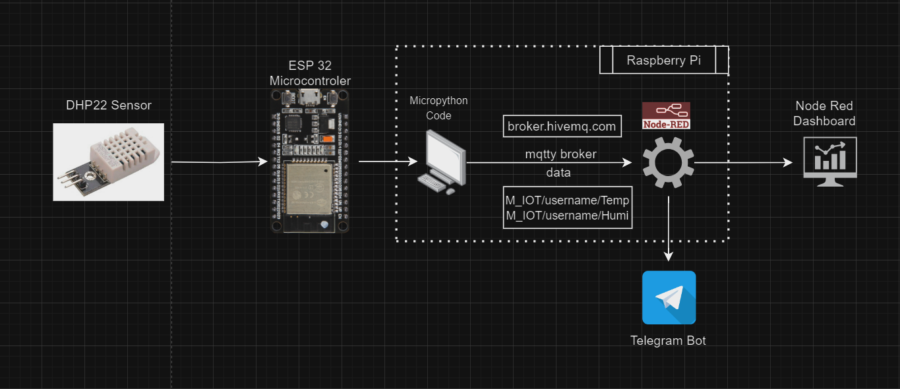

# MQTT Weather Bot 
**Using ESP8266  , DHT22 sensors, MicroPython, Node-RED, and Telegram.**

*Project of Tapan Solanki - StudentID : S0590693*

## Overview:-
This project aims to create a comprehensive weather monitoring system leveraging the capabilities of an ESP8266  microcontroller, Node-RED for data processing, and a Telegram bot for user interaction. The system seamlessly collects real-time acurate weather data through sensors connected to the ESP8266, processes the data with Node-RED, and provides users with an intuitive user interface via a Telegram bot.

### Hardware Components:

1. **ESP8266  Microcontroller**

2. **DHT22 Sensor**

3. **Raspberry Pi**


### Software Components:

1. **Thonny (MicroPython) on Raspberry Pi**
2. **Node-RED on Raspberry Pi**
3. **Telegram Bot**

## Initial Setups:

1.  **Node-Red**
   
   Install Node.js, as Node-RED runs on it. You can download it from Node.js website.
After installing Node.js, run npm install -g node-red in your command line to install Node-RED globally.
To start Node-RED, run node-red in your command line, and then access it in a web browser at http://localhost:1880.


2. **Thonny**

Download the Thonny IDE from its [official website](https://thonny.org/).
Install it like any regular application on your operating system.
Once installed, open Thonny to start coding in Python.

3. **Telegram Bot**

Telegram Bots are third-party applications that run inside Telegram. They can interact with users in a number of ways.

4. **Raspberry Pi Environment**

Setting up a Raspberry Pi environment involves installing an OS and setting up the Raspberry Pi hardware.

Steps:

-Download the Raspberry Pi Imager from the [Raspberry Pi website](https://www.raspberrypi.com/software/).
Use the imager to install a Raspberry Pi OS (formerly Raspbian) onto an SD card.\
-Insert the SD card into your Raspberry Pi, connect peripherals (like a keyboard, mouse, and monitor), and power it up.\
-Follow the on-screen instructions to complete the setup.

5. **Wokwi**

Wokwi is an online simulator for Arduino and other electronic projects. It's a online tool, so there's no need to install anything.Simply visit the [Wokwi website](https://wokwi.com/) and start using the simulator in your browser

## Project Structure:- 

## Impletation Work Flow:
#### MicroPython Code:
Deploy MicroPython on the Raspberry Pi and upload the MicroPython script to read sensor data from ESP8266 and publish to MQTT.
  >Here's a sample Micropython Code:-
   ```python
   import dht
import machine
import network
import time
from umqtt.simple import MQTTClient

wlan = network.WLAN(network.STA_IF) # create station interface
wlan.active(True)       # activate the interface
wlan.connect('Rechnernetze', 'rnFIW625') # connect to an AP
time.sleep(3)
print(wlan.ifconfig())

d = dht.DHT22(machine.Pin(15))
d.measure()
d.temperature() # eg. 23.6 (°C)
d.humidity()    # eg. 41.3 (% RH)
print("The Temp")

client=MQTTClient("Tapan","broker.hivemq.com")
client.connect()

while True:
    d.measure()
    client.publish("M_IoT/Tapan/temp",str(d.temperature()))
    client.publish("M_IoT/Tapan/humi",str(d.humidity()))
    print("The Temperature is: ",d.temperature())
    print("The Humidity is:",d.humidity())
    time.sleep(20)

   ```
#### Node-Red Flow
- [ ] Set up flows on the Raspberry Pi to receive and process MQTT data.
- [ ] Integrate Telegram nodes for communication.
- [ ] Added a trigger node that activates when the switch function condition for temperature and humidity values changes, triggering an alert.
 
#### Telegram Bot Integration:
- [ ] Add the API key for the Telegram bot to the Telegram node in Node-RED flow.

#### Deployment:
- [ ] Running MicroPython connected with the ESP8266 Powered on, in the desired location for continuous weather monitoring.

## Screenshots:
- [NodeRed Flow](https://gitlab.rz.htw-berlin.de/huhn/proit-d_ws2324/-/blob/s0590693/images/flow.png)
- [Telegram Bot ](https://gitlab.rz.htw-berlin.de/huhn/proit-d_ws2324/-/blob/s0590693/images/demo.jpg)
- [Nodered Dashboard](https://gitlab.rz.htw-berlin.de/huhn/proit-d_ws2324/-/blob/s0590693/images/dashboard.png)

## Possible Future Enhancements
### -  Open  Souce Wheather API
In addition to real-time weather data collected from local sensors, we have explored the integration of external APIs for fetching additional weather information and forecasts. OpenWeatherMap API is a popular choice for obtaining comprehensive weather data.\
:link:[OpenWeatherMap API](https://openweathermap.org/api)

### - Voice Interaction
Integrate voice commands for user interaction. This enhancement could allow users to inquire about weather conditions using natural language, making the system more accessible and user-friendly. Google Cloud provides a powerful Speech-to-Text API that can be integrated. It supports multiple languages and works well with various audio formats.\
:link:[Google Cloud Speech-to-Text API](https://cloud.google.com/speech-to-text/?utm_source=google&utm_medium=cpc&utm_campaign=emea-de-all-en-dr-bkws-all-all-trial-e-gcp-1707574&utm_content=text-ad-none-any-DEV_c-CRE_574683149009-ADGP_Hybrid+%7C+BKWS+-+EXA+%7C+Txt+~+AI+%26+ML+~+Speech-to-Text%23v16-KWID_43700053279880858-aud-606988878214:kwd-295515021979-userloc_9068242&utm_term=KW_google%20speech%20to%20text-NET_g-PLAC_&&gad_source=1&gclid=CjwKCAiA75itBhA6EiwAkho9e48uti529tIHjp9sx39L6i2tOPLVViGxLRNod3DRDrG4IuLiTPVQ4BoCOGoQAvD_BwE&gclsrc=aw.ds)


### -  Historical Weather Data Storage


Explore options for storing historical weather data for trend analysis. Integrate a database like InfluxDB for efficient data management.\
:link:[InfluxDB](https://www.influxdata.com/) 

## References
- [Node-RED documentation](https://nodered.org/docs/)
- [MicroPython ESP8266 documentation](https://docs.micropython.org/en/latest/esp8266/quickref.html)
- [Telegram Bot API](https://core.telegram.org/bots/api)
- [Wokwi - Online Simulator](https://wokwi.com/)
- [ChatGPT](https://chat.openai.com/)
- [Bard](https://bard.google.com/)


   
